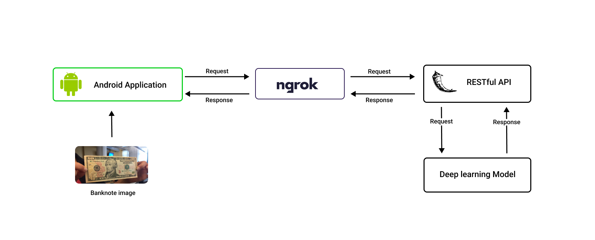

`All rights for the source code and other related material are reserved`

# Problem
The human brain is capable of absorbing multiple types of information and identifying 
banknotes with less effort, therefore identification is a pretty simple task for human eyes.
However, once in circulation, banknotes might face a variety of faults in image 
recognition. Thus, no country is protected from the problem of counterfeiting banknotes. 

Because of rapid technological advances in color printing, cloning, and imaging, and 
because false notes are now duplicated using top-notch technology that uses security 
paper, identifying between fake and real currency banknotes has grown rather difficult 
over the years.

 

# Solution
The system consists of 2 main components, Android application and Flask RESful API
 that deploys the machine learning model.

The RESTful API is mirrored to public URL using the cross-platform application ngrok. when the Python
RESTful API is deployed using ngrok, it will build with a random URL that ngrok provides and it will be 
used by the frontend to make requests and receive responses from the server.

 

# Related repositories
  
- CounterfeitSeeker mobile repository- `Not available publicly`

- CounterfeitSeeker RESTful API respository - `Not available publicly`

 

# Convolutional Neural Networks
Two convolutional neural networks were trained as follows

- CNN model built from scratch - 18 layer CNN model trained to accurately perform banknote identification and classification.

- VGG19 transfer learning model - Modified VGG-19 network trained to be used in banknote identification and classification.

 

# Technologies Used
 
 
 
 

 

# Future Enhancements

- Identify counterfeit banknotes in multiple currencies including Euro, Sri Lankan Rupees, Australian dollars, UK pounds, etc.

- explore the Convolutional Neural Network's deeper architecture to increase performance 

- Develop the mobile application for cross-platform

